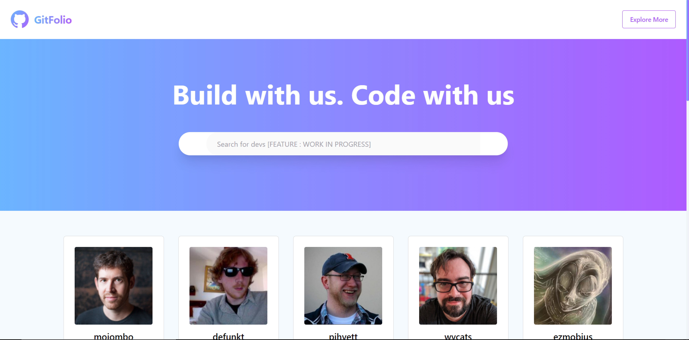
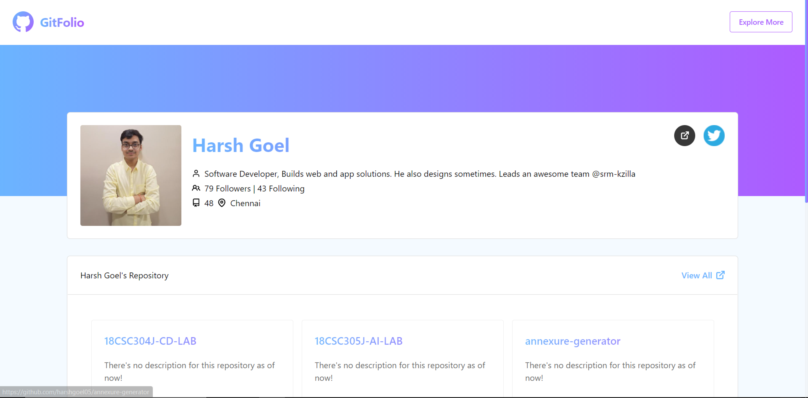
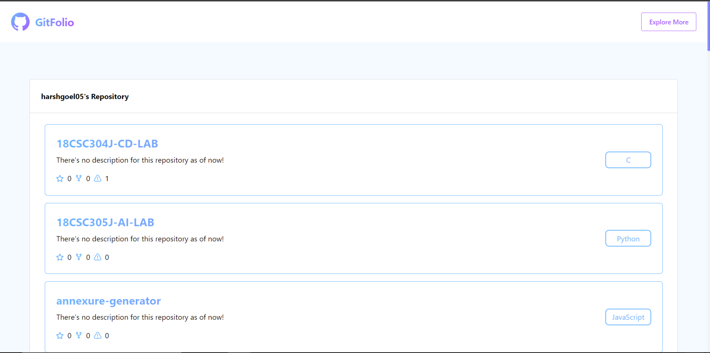
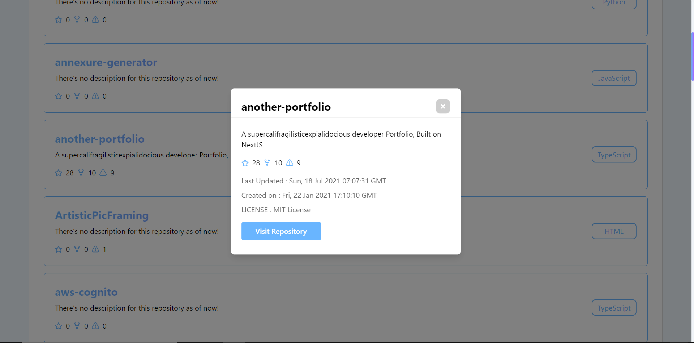

<br>

<div align="center">
  
</div>

<br>
<p align="center">
Build with us. Code with us 
</p>
<p align="center">
crafted with <span style="color: #8b0000;">&hearts;</span> by <a href="https://harshgoel.me">Harsh Goel</a>.
</p>

## Preview 📺

<div align="center">
  
</div>
<br>
<div align="center">
  
</div>
<div align="center">
  
</div>
<div align="center">
  
</div>

## Installation 🔧

Install dependencies

```
$ yarn
```

Start the development server

```
$ yarn dev
```

Build the app

```
$ yarn build
```

## Contributing 🤝

Please read `Contributing.md` for details on our code of conduct, and the process for submitting pull requests to us.